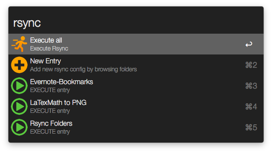

# Rsync Folders for Alfred

Rsync Folders is mirroring two folders e.g. it can be helpful to keep Alfred Workflow folder in sync with the local GIT folder. 

**The following options are available:**

Usage: `rsync`

* Executes rsync on *all* rsync entries or the entries one by one.
* New Entries can be added by browsing folders or by entering the source and target paths (*New Entry* + `CMD`).
* Delete rsync config entries one by one (*Entry* + `CMD`).
* Edit entry to change title (`ALT`)

