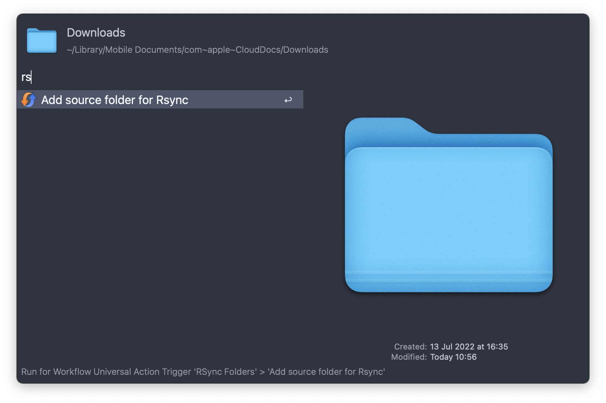

# Rsync Folders for Alfred

Rsync Folders is mirroring two folders e.g. it can be helpful to keep Alfred Workflow folder in sync with the local GIT folder. 

**The following options are available:**

Usage: `rsync` 

* Executes `rsync``on *all* rsync entries or the entries one by one.
* New Entries can be added in the workflow or via file action

Add...

Add via file action...

